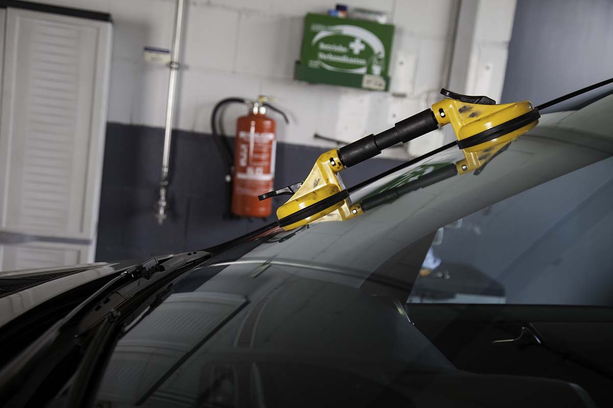

Have you ever enjoyed a carefree cruise down the highway only to be suddenly disrupted by a passing truck or vehicle that flings debris in your direction? The impact of even the smallest debris can be startling enough to jolt you into an adrenaline rush. And for good reason. Your windshield usually takes the brunt of the impact and hopefully doesn’t shatter. You may find yourself relieved to notice only a small chip or crack. Should you be worried?

According to Matthews Tire Appleton East Manager Craig Keberlein, “A crack can be dangerous, and chips—when unaddressed—can turn to cracks.” Windshields have a lot of structural importance to the integrity of the vehicle and could degrade the safety of the vehicle, he explained.

Keberlein recommends getting even a tiny chip or crack assessed by an automotive professional immediately. “For minor chips and cracks, the sooner you get in, the better the repair will turn out,” he clarifies. “We can seal the crack before it fills with dirt, debris or water and to prevent it from spreading any further. If addressed immediately, chips and cracks will visually look better than if you wait.”

Matthews Tire has the ASE-certified technicians, quality replacement parts and technology to make repairs and even replace entire front and rear windshields. It only takes a few hours, with one stipulation, Keberlein warns. “Our only challenge can be getting the materials. We used to be able to get new windshields in the same day. Since the pandemic, it can take one or two days to get products.”

Aside from maintaining access to inventory, another important component to consider with windshield replacement—particularly with newer models—is built-in technology. Many windshields have Advanced Driver-Assistance Systems (ADAS) features such as cameras, radar and lane departure technologies. Matthews Tire’s ASE-certified technicians are fully capable with the proper training and technology to recalibrate ADAS systems when replacing a windshield.

For regular maintenance—including comprehensive ADAS service and windshield repair/replacement—visit the ASE-certified experts at your neighborhood Matthews Tire today!

<a href="https://matthewstire.com/locations" class="btn btn-primary btn-small">Find your nearest Matthews Tire</a>
