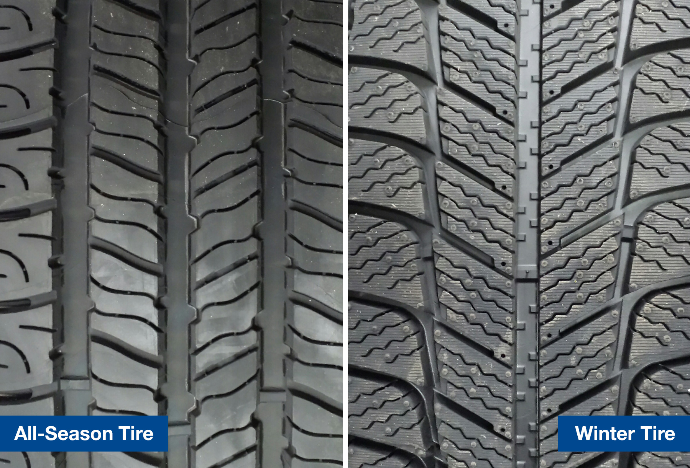

Shovels. Hats and mittens. Puffy coats.

There are endless essentials that can help you make it through the winter. What else comes to mind … maybe a warm fireplace, cozy blankets or even heated seats in your car. How about winter tires?

Winter tires are not ‘a thing of the past’—they’re crucial to help protect you and your loved ones during winter, in more ways than one:

**Longer Tire Life**

Would you wear flip flops in the snow and boots on the beach? Probably not. Winter tires are made with soft tread compounds to create a sturdier grip to perform well in snow, ice, sleet, slush, wet and cold dry roads.

When winter tires are used in warmer weather, the soft tread compounds wear out faster than the harder compounds used in all-season tires. Using the right tires during the right weather will lead to longer tire life for both your winter and all-season tires.

**Thirty-Feet Rule**

According to [Justin Pritchard](http://thechronicleherald.ca/wheelsnews/1247956-six-important-reasons-to-add-winter-tires-to-your-ride), an automotive consultant at the Automobile Journalists Association of Canada, a set of winter tires can slash 30 feet or more from your stopping distances on snow—that’s the distance across a small intersection.

Many people think winter tires don’t make that much of a difference while driving, but it can be a key factor in avoiding an accident on a slippery road.

**Enhanced Safety**

“Winter tires have a special type of thread compound with a more aggressive tread pattern that will give better grip during colder and snowier weather,” says Rick Roesler, Matthews Tire Manager at the Appleton East location. “Even when temperatures drop under 45 degrees, all-season tread compounds can change causing more slippage.”

Imagine you’re walking on an icy path and you had the choice to wear winter boots or tennis shoes … which would you wear? Of course you’d pick the winter boots because you know the likelihood of falling or slipping will decrease—the same concept applies with winter tires.

Most drivers feel more confident and in control while driving on icy or snowy roads with winter tires. “For added security, winter tires will give you peace of mind to handle almost any driving conditions during the winter months,” says Roesler.

**And remember, if you have any questions about tires or automotive needs, don’t hesitate to [call the pros at Matthews Tire](/contact)!**
