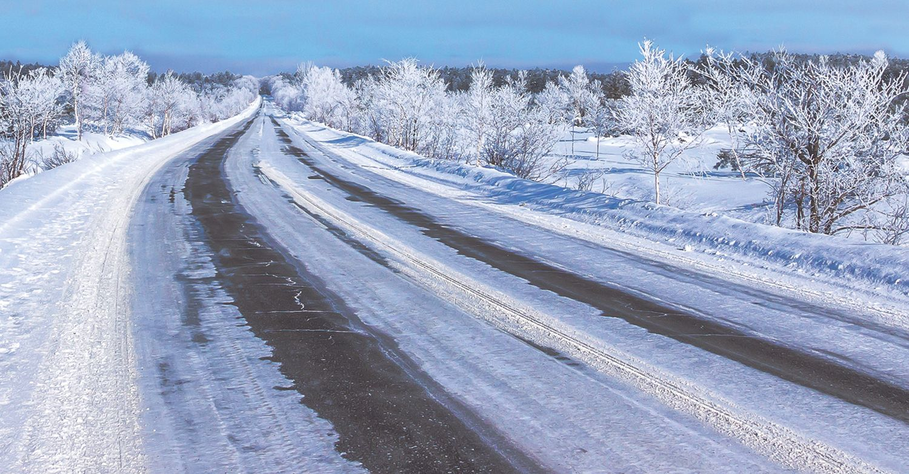

When it comes to harsh winter weather and even harsher driving conditions, seasoned Wisconsinites have seen—and braved—it all. We asked our management team for some handy tips and trusted advice to keeping you rolling all winter long, and they delivered!

## Think Ahead

“Good wiper blades are important. If you drive a lot, especially in rural settings, winter tires make a huge improvement for traction and overall safety. Also, this seems obvious, but leave a little earlier if there’s bad weather!”

> Craig Keberlein, Matthews Tire Manager, Appleton East

## Be Prepared

“Always be prepared. Keep your fuel tank at least half full, and make sure your windshield washer fluid is full and functional. It’s also a good idea to store extra winter hats, gloves and boots in the car. A small or compact shovel may be handy if you get stuck in deep snow. And if you’re really stuck in deep snow, placing floor mats under your tires can help you get out.”

> Todd Steffes, Matthews Tire Manager, Fond du Lac

## Stay Safe

“When driving in winter weather conditions, people should give longer distance for braking. The biggest thing is, if you’re ever involved in a collision—especially on the highway or another high-traffic area—don’t get out of your car. And if you have to steer to the ditch to avoid a collision, steer right if possible, versus into the center. No matter what, make sure you remain in your vehicle until you know it’s a safe place to get out.”

> Tom Winninghoff, Matthews Tire Manager, Green Bay

## Keep Control

“Make sure you have good tires on your vehicle. Check weather and road conditions before you depart. If the road looks wet, and it's 30 degrees out, it’s most likely icy. If you do venture onto icy roads, never use cruise control! It may cause the tires to spin, and you could lose control. And, if you do start to spin out, do NOT lock up your brakes. You will have more control of the vehicle just by letting off the gas.”

> Nathan Ernst, Matthews Tire Manager, Waupaca

## Slow Down

“When turning corners, really slow down—almost to a stop—before turning, otherwise you will stop when you hit the curb. Winter tires provide the safest travel in winter and usually cost less than getting into an accident. Fill tires to 2psi to 3psi over the suggested air pressure so the Tire-pressure Monitoring System light is less likely to come on as it gets colder. Make sure your battery checks out. Always call authorities when involved in an incident.”

> Dave Flunker, Matthews Tire Manager, Appleton West

No matter how often you drive or how equipped you may be to drive in winter weather, remember to remain vigilant, take it slow, and stay home if possible. And, it’s never too late to equip your car with winter tires! <a href="https://matthewstire.com/locations">Schedule an appointment</a> at Matthews Tire for new tires and expert service to help you and your vehicle get through the winter!
