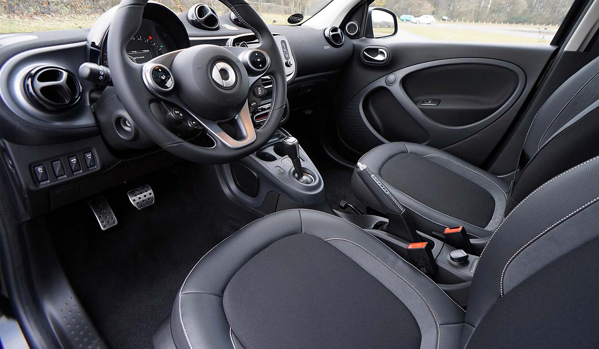

If you’re looking for productive ways to fill time at home, now is a great opportunity for spring cleaning! Sanitization and cleanliness have never been more important and that applies to your vehicles too—especially because the average American spends almost 11 hours behind the wheel each week, according to 2019 Cision data. We’ve compiled an ultimate spring-cleaning checklist to guide you both at home and the autobody shop, so when you’re ready to get back to life as usual, your car will also be ready to take you anywhere you want to go.

## Spring-Cleaning Checklist

### _for your vehicle_

#### At Home

- Vacuum/wash interior
- Clean out trunk
- Wash exterior
- Wax exterior
- Repair any scratches
- Clean engine bay
- Pack jumper cables/tools
- Replenish first aid kit
- Pack flashlight
- Check spare tire

#### At the Auto Shop

- Check/change oil
- Check battery
- Check hose/belts
- Check transmission
- Check heat/air conditioning
- Replace wiper blades
- Top off fluids
- Rotate/change tires
- Check anti-freeze
- Check brakes

##### Take this list with you to the garage!

  <a href="/documents/your-complete-spring-cleaning-checklist.pdf" class="btn btn-primary heroButton" target="\_blank">Download a printable version</a>

